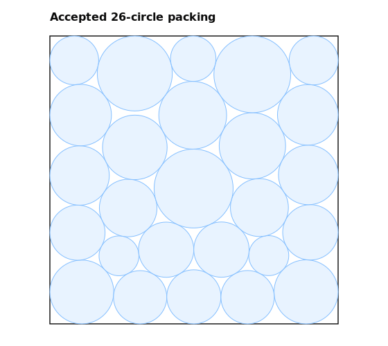
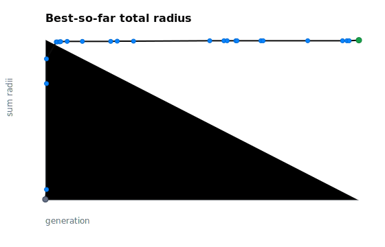
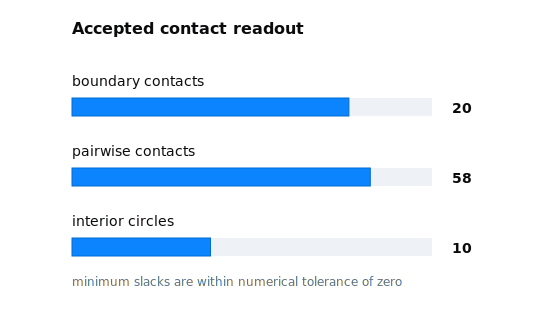

# 26-circle unit-square packing

[Published web article](https://www.gotherlabs.com/results/circle-packing-26-unit-square/) · [Animated run surface](https://www.gotherlabs.com/results/circle-packing-26-unit-square/run/) · [Structured metadata](result.json) · [Evaluation contract](artifacts/evaluation_contract.md) · [Accepted candidate](artifacts/accepted_candidate.py)

## Abstract

This result reports a deterministic packing of 26 non-overlapping circles inside
the unit square. The accepted geometry reaches a validated total radius of
2.635977, starting from a sparse public baseline at 0.959778. Because the
evaluator score is the negative total radius, the governed lower-is-better score
moves from -0.959778 to -2.635977.

The claim is deliberately bounded: this is not a proof of global optimality and
not a general circle-packing solver. It is a public, replayable geometry result
with three audit surfaces: the accepted candidate code, the frozen validation
contract, and the scored public trace that led to the retained packing.

The result is also close to the strongest public AI-discovery references listed
in the comparison artifact. It exceeds the original AlphaEvolve value reported
for \(n = 26\), while remaining about 0.000006 total radius below the later
2.635983 references.

## 1. Problem formulation

The task is to place 26 circles in the unit square without overlap. A packing is
defined by centers \((x_i, y_i)\) and radii \(r_i\) for
\(i = 1, \dots, 26\). The geometric objective is the total radius:

$$
R(P) = \sum_{i=1}^{26} r_i
$$

Every circle must remain inside \([0,1]^2\), and every pair of circles must
satisfy the non-overlap constraint:

$$
\sqrt{(x_i-x_j)^2 + (y_i-y_j)^2} \ge r_i + r_j.
$$

## 2. Evaluation contract

The evaluator asks the candidate for exactly 26 centers, 26 positive radii, and
a reported sum. It rejects non-finite values, mismatched reported sums,
unit-square boundary violations, pairwise overlaps, and non-deterministic
repeat calls.

See [evaluation_contract.md](artifacts/evaluation_contract.md).

The score is:

$$
J(P) = -R(P).
$$

Lower score is therefore better under the evaluator, while total radius remains
the direct geometric readout.

## 3. Accepted candidate

The accepted public candidate is a deterministic reconstruction program rather
than a stored coordinate table. It starts from a coarse deterministic seed,
solves boundary and pairwise tangency equations with a damped Newton system, and
validates the reconstructed geometry before returning it to the evaluator.

See [accepted_candidate.py](artifacts/accepted_candidate.py).

This distinction matters for review. The replayed centers and radii are retained
as audit evidence, but the implementation surface is the reconstruction code
that regenerates the accepted contact graph.

## 4. Result summary

| Readout | Value |
| --- | ---: |
| Baseline total radius | 0.959778 |
| Accepted total radius | 2.635977 |
| Total-radius gain | 1.676199 |
| Evaluator score change | -0.959778 to -2.635977 |
| Boundary contacts detected | 20 |
| Pairwise contacts detected | 58 |
| Interior circles | 10 |
| Minimum radius | 0.069357 |
| Maximum radius | 0.135128 |

The public trajectory has three visible phases. The original `program.py`
baseline is a sparse packing with total radius 0.959778. Early generated
candidates move quickly into useful geometries: the first valid candidate
reaches 1.064234, and generation 1 later produces the retained 2.438966
checkpoint. Later candidates mostly explore the high-radius plateau until the
accepted reconstruction reaches 2.635977.

See [metrics.json](artifacts/metrics.json) and
[score-trace.json](artifacts/score-trace.json).

The accepted packing is tight in the sense exposed by the public diagnostics:
20 boundary contacts and 58 pairwise contacts are detected at the public
tolerance. The smallest boundary and pairwise slacks are near machine precision,
so the contact readout is a structural check on the geometry rather than a
separate optimization claim.

## 5. External comparison

The comparison artifact records the public reference values used for context:

| Reference | Reported total radius | Difference versus this result |
| --- | ---: | ---: |
| AlphaEvolve | 2.635862 | +0.000115 |
| AlphaEvolve V2 | 2.635983 | -0.000006 |
| ShinkaEvolve | 2.635982 | -0.000005 |
| ThetaEvolve | 2.635983 | -0.000006 |
| TTT-Discover | 2.635983 | -0.000006 |

Positive differences mean the accepted Göther Labs geometry has the larger
total radius; negative differences mean the reference value is larger. The
2.635983 gap is about 0.000213% in total radius, so this result reaches
99.999787% of that reference value.

See [reference-comparison.json](artifacts/reference-comparison.json). The
external values are taken from the circle-packing table in
[Learning to Discover at Test Time](https://test-time-training.github.io/discover.pdf).

## 6. Limitations

This is a result for the 26-circle unit-square packing contract only. It does
not claim a general solver for other circle counts, other containers, changed
objectives, or arbitrary contact graphs. Changing any of those terms creates a
new evaluation.

The external comparison is contextual rather than a leaderboard claim. It uses
the values reported in the cited public table and does not independently rerun
those systems under this repository's evaluator.

The accepted candidate is deterministic and reconstructs this validated contact
graph. Its purpose is auditability of this geometry, not broad instance
generation.

## 7. Reproducibility

The public bundle includes the accepted candidate, evaluation contract, curated
evolution chain, scored-candidate trace, metrics, provenance, replay
confirmation, figures, and the public
[animated run surface](https://www.gotherlabs.com/results/circle-packing-26-unit-square/run/).
The run page is a presentation layer over the same public artifacts and excludes
raw operational material.

Useful entry points:

- [accepted_candidate.py](artifacts/accepted_candidate.py): deterministic
  reconstruction code
- [evaluation_contract.md](artifacts/evaluation_contract.md): frozen validator
  behavior
- [replay.json](artifacts/replay.json): accepted replay and geometry trace
- [metrics.json](artifacts/metrics.json): headline numerical readouts
- [score-trace.json](artifacts/score-trace.json): public scored-candidate trace
- [reference-comparison.json](artifacts/reference-comparison.json): external
  comparison values

The source bundle is available in the
[Göther Labs results repository](https://github.com/Gother-Labs/gother-labs-results/tree/main/results/circle-packing-26-unit-square).
