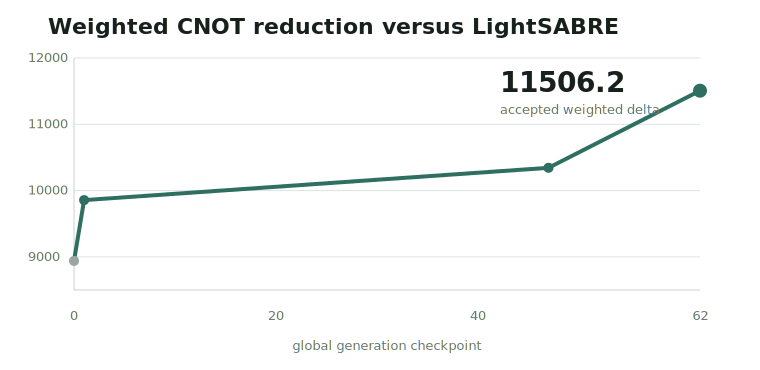
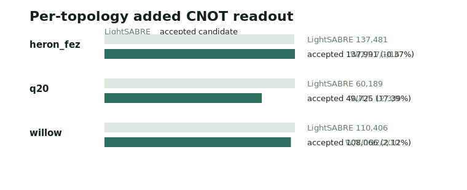
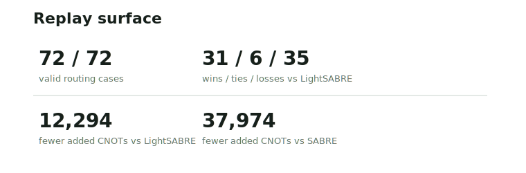

# Qubit routing LightSABRE benchmark

## Abstract

This note reports a deterministic qubit-routing policy, a public scoring trace,
and an exact replay candidate for a frozen swap-reduction benchmark. The
accepted policy reduces added CNOTs by 12,294 versus LightSABRE while keeping
the routing-policy surface and topology split visible.

The claim is deliberately bounded: it is not a universal quantum compiler
result, not a runtime benchmark, and not a hardware-performance claim.

## 1. Problem formulation

The two-qubit gate that matters in this benchmark is the CNOT. A CNOT flips the
target qubit only when the control qubit is 1; together with arbitrary
one-qubit gates, CNOT is a standard building block for universal quantum
circuits. Hardware routing matters because a SWAP between adjacent physical
qubits is normally decomposed into three CNOTs, so every extra SWAP directly
inflates the added-CNOT readout.

Qubit routing maps a logical circuit onto a physical device topology. When two
logical qubits that need a two-qubit gate are not adjacent on the target
topology, the router inserts SWAPs. Those SWAPs increase the compiled circuit
cost; in this public benchmark the observable readout is added CNOT count.

The optimization lever is intentionally narrow: the policy still inserts swaps
to satisfy adjacency, but it can avoid paying a restore swap when the resulting
logical-to-physical permutation is useful for the next routed interaction.

## 2. Evaluation contract

The evaluator compares the candidate against LightSABRE on 24 circuits crossed
with three topology targets: Q20, Willow, and Heron-FEZ. In this report those
names identify frozen coupling graphs: the physical adjacency constraint on
which each logical two-qubit interaction must be routed.

For candidate policy \(p\), the governed score is:

$$
J(p) = -\Delta_{\mathrm{wCNOT}}(p),
\qquad
\Delta_{\mathrm{wCNOT}}(p)
  = \sum_{(c,\tau)\in P} w_{c,\tau}
    \left(A_{\mathrm{LS}}(c,\tau)-A_p(c,\tau)\right).
$$

Here \(A_p(c,\tau)\) is the added-CNOT count for policy \(p\) on circuit \(c\)
and topology \(\tau\), \(A_{\mathrm{LS}}\) is the LightSABRE reference, and
\(w_{c,\tau}\) is the public case weight. Lower \(J(p)\) is better; the result
plots \(-J(p)\) so that positive weighted CNOT reduction reads upward.

See [evaluation_contract.md](artifacts/evaluation_contract.md).

## 3. Accepted candidate

The accepted candidate is a Rust routing-policy implementation. It combines a
topology-aware initial layout with a SABRE-style swap scorer, while keeping
front-layer distance, extended-set lookahead, and decay behavior visible in one
deterministic policy surface.

See [accepted_candidate.rs](artifacts/accepted_candidate.rs).

The accepted candidate changes routing-policy logic inside the fixed benchmark
scaffold. The portfolio assets, topology targets, reference LightSABRE
comparison, and replay validator remain unchanged.

## 4. Results

The accepted replay reduced aggregate added CNOT count from LightSABRE's 308,076
to 295,782 across the 72-case portfolio. The aggregate reduction is 12,294
added CNOTs, and the case split is 31 wins, 6 ties, and 35 losses versus
LightSABRE.

The result is not uniform across topology families. Q20 carries the largest
positive readout, Willow is modestly positive, and Heron-FEZ is slightly worse
than LightSABRE on aggregate. The public result keeps that split visible instead
of compressing it into only the all-portfolio score.

The selected case-level readout highlights the largest positive exported case
savings. These rows are sorted by absolute CNOT reduction versus LightSABRE and
are not a second aggregate readout.

See [metrics.json](artifacts/metrics.json), [replay.json](artifacts/replay.json),
and [score-trace.json](artifacts/score-trace.json).

## 5. Limitations

This report is limited to the frozen 24-circuit LightSABRE portfolio in the
bundle. It does not claim improvement on arbitrary circuits, arbitrary hardware
topologies, all related benchmark assets, or production compiler workloads.

The benchmark measures routing quality through added CNOT count. It does not
make a wall-clock speed claim, does not measure hardware execution fidelity, and
does not evaluate downstream transpiler passes after routing.

## 6. Reproducibility

The public bundle includes the accepted Rust candidate, the evaluation contract,
metrics, a curated evolution chain, replay confirmation, public figures, and a
curated animated replay at
[the run page](https://www.gotherlabs.com/results/qubit-routing-lightsabre/run/).
The replay excludes prompts, raw telemetry, local logs, private paths, and
operational run state.

Replaying the result should use the same 24-circuit LightSABRE portfolio, the
same Q20, Willow, and Heron-FEZ coupling graphs, the same added-CNOT objective,
the same case weights, and the same lower-is-better governed score. Changing the
topology set, case set, routing objective, or LightSABRE reference creates a new
evaluation, not a replay of this result.

Under that replay contract, the accepted Rust candidate reproduces 295,782
aggregate added CNOTs, 12,294 fewer than the LightSABRE reference, with a
31 / 6 / 35 win/tie/loss case split.
