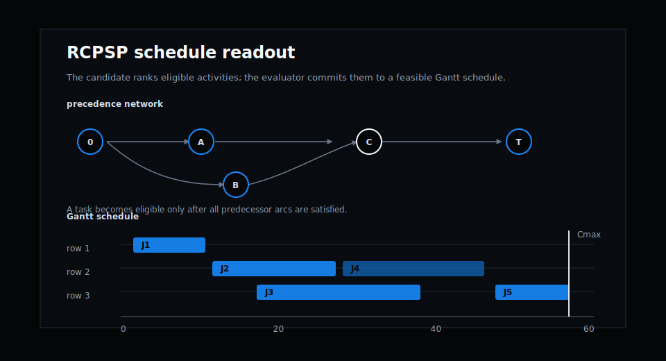
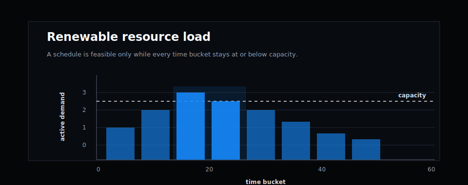
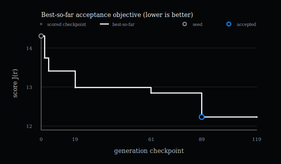
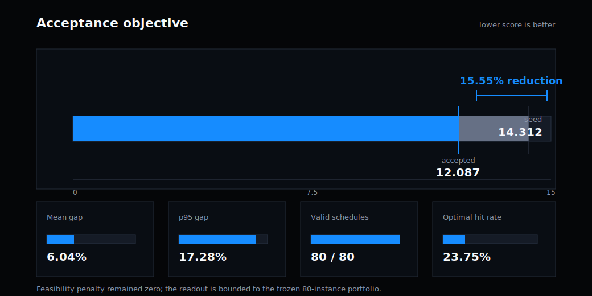
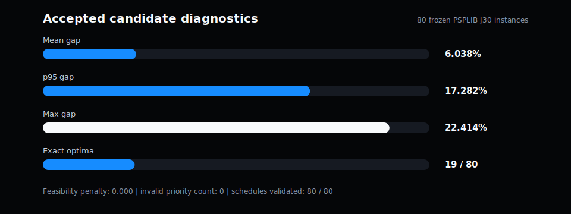
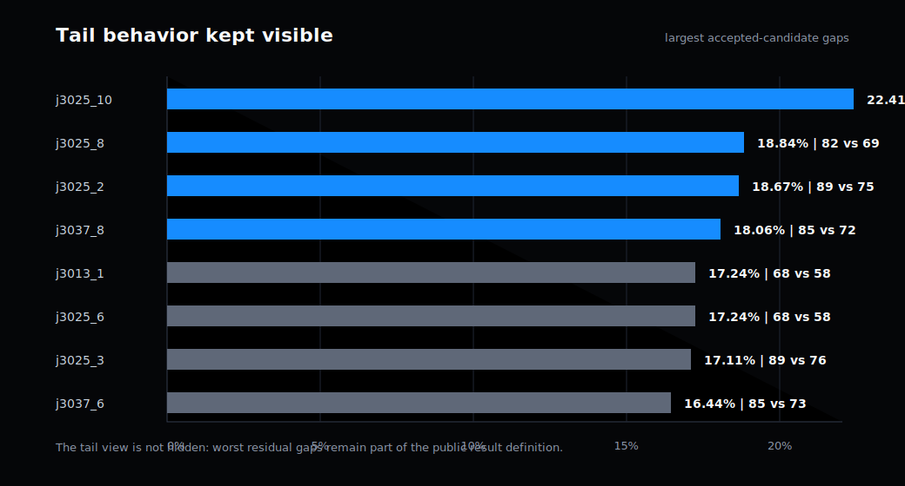

# PSPLIB J30 scheduling benchmark

[Published web article](https://www.gotherlabs.com/results/rcpsp-psplib-j30/) · [Structured metadata](result.json) · [Evaluation contract](artifacts/evaluation_contract.md) · [Accepted candidate](artifacts/accepted_candidate.py)

## Abstract

This note reports a deterministic dispatch rule for the Resource-Constrained Project Scheduling Problem (RCPSP). On a frozen public subset of PSPLIB J30, the evolutionary chain reduced the lower-is-better acceptance score from 14.312 to 12.087, a 15.55% reduction, while preserving feasibility on all 80 evaluated instances.

For audit clarity, the public claim is the curated evolutionary chain, not a claim about the final isolated diagnostic run.

The benchmark is deliberately external and bounded. Each portfolio instance has a proven optimal makespan, so the reported score measures schedule quality against a reference optimum rather than machine speed. The result should be read as a scheduling benchmark result on this fixed PSPLIB J30 subset, not as a claim that every RCPSP instance or production planning workflow is solved.

## 1. Problem formulation

RCPSP schedules a project made of activities, precedence constraints, and renewable resource limits. An activity can start only after its predecessors finish, and the resource demand of all activities active at the same time must fit within the available capacity. The schedule objective is the project makespan: the finish time of the terminal activity.

$$
C_{max}(S) = \max_i F_i
$$

where \(F_i\) is the finish time of activity \(i\) in schedule \(S\).

The evaluator uses serial schedule generation. At each step it finds eligible activities, scores each one with the candidate rule, asks the selector to choose one eligible activity, and places that activity at the earliest resource-feasible start time. This keeps the optimization surface narrow: the candidate changes priority logic, not the scheduling validator.

## 2. Benchmark and evaluation contract

The public portfolio contains 80 frozen PSPLIB J30 single-mode instances. The selection is parameters \(\{1, 7, 13, 19, 25, 31, 37, 43\}\) crossed with instances 1 through 10. Every instance has 32 jobs including dummy source and sink jobs, renewable-resource capacities, precedence arcs, and a proven optimal makespan.

See [evaluation_contract.md](artifacts/evaluation_contract.md).

For one instance \(k\), the evaluator computes a makespan gap against the proven optimum:

$$
g_k = 100 \cdot \frac{C_{max,k}^{candidate} - C_{max,k}^{optimal}}{C_{max,k}^{optimal}}.
$$

The retained objective combines portfolio mean quality with a tail-risk term:

$$
score = mean(g_k) + 0.35 \cdot p95(g_k) + feasibility\_penalty.
$$

A candidate must keep the feasibility penalty at zero. It must return finite priority scores, choose only eligible activities, schedule every activity exactly once, respect all precedences, and never exceed renewable resource capacities.

## 3. Accepted candidate

The accepted candidate keeps the serial schedule generator unchanged and changes only the activity-ranking policy. The final rule combines critical-path urgency, successor-unlocking pressure, bottleneck resource pressure, resource pressure, wait pressure, and remaining-work pressure. The selector then prefers activities that can start earlier and uses the priority score as the second-order decision.

See [accepted_candidate.py](artifacts/accepted_candidate.py).

This is intentionally inspectable. The candidate is not a solver replacement or a hidden search procedure. It is a deterministic dispatch rule inside a fixed evaluator.

## 4. Results

The public chain moved from the seed score of 14.312 to an accepted score of 12.087. Figure 3 shows the full scored-candidate trace; Figure 4 summarizes the reported seed-versus-accepted comparison.

Figure 5 translates the aggregate result into one real portfolio instance, `j3025_9`. Unlike the introductory schematic, it uses all executable jobs from the instance and the same instance's renewable-resource load buckets.

See [metrics.json](artifacts/metrics.json) and [score-trace.json](artifacts/score-trace.json).

Figure 6 keeps the accepted-candidate diagnostics separate from the chain objective. In absolute benchmark terms, this is not a 99% approximation claim: the mean accepted makespan is about 106.04% of the proven optimum, or roughly 94.31% if expressed as optimum divided by candidate makespan.

The worst residual gaps remain visible because they matter operationally. Figure 7 is the tail readout: it shows the largest accepted-candidate residual gaps and their makespan-versus-optimum comparison.

## 5. Limitations

This result is limited to the frozen 80-instance PSPLIB J30 subset. PSPLIB contains 480 J30 instances with proven optima; this report does not claim evaluation over all 480. It also does not measure wall-clock optimization speed, human planner usability, robustness under changed project distributions, or production integration behavior.

The accepted rule is deterministic and feasible under this evaluator, but it is still a dispatch heuristic. A different project class, different resource model, multi-mode activity model, stochastic arrivals, or operational priority policy would require a new evaluation contract.

## 6. Reproducibility

The bundle includes the accepted candidate, evaluation contract, curated evolution chain, metrics, provenance, replay confirmation, and public figures. A curated animated replay of the same public trace is available at [the run page](https://www.gotherlabs.com/results/rcpsp-psplib-j30/run/). It is a presentation layer over the same artifacts, not a separate result, and excludes prompts, raw logs, telemetry, and non-public proposal context.

Replaying the result should use the same PSPLIB J30 portfolio, the same proven optimal makespans, the same score formula, and the same lower-is-better direction. Changing the instance set or objective creates a new evaluation, not a replay of this result.

The source bundle is available in
[Göther Labs results repository](https://github.com/Gother-Labs/gother-labs-results/tree/main/results/rcpsp-psplib-j30).
