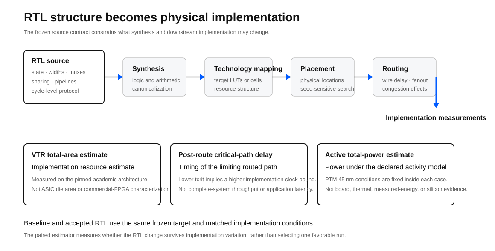
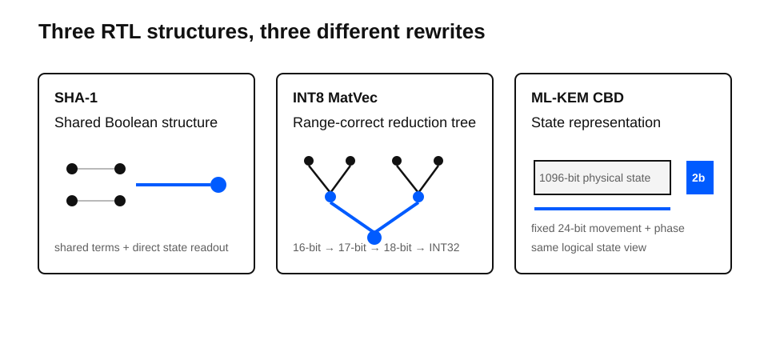
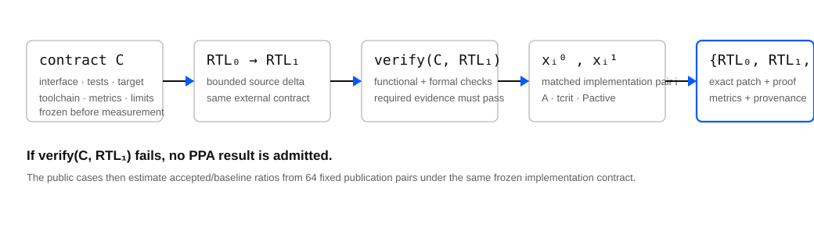
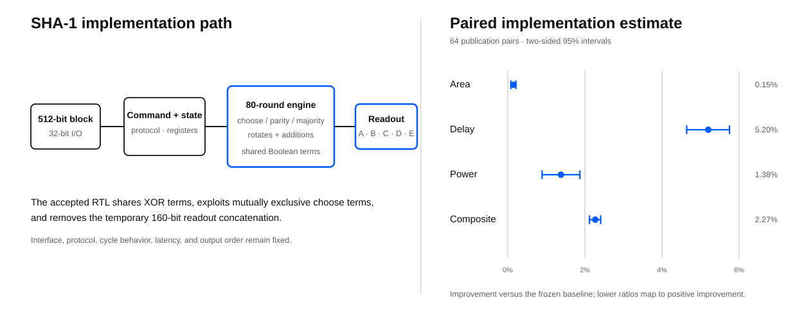
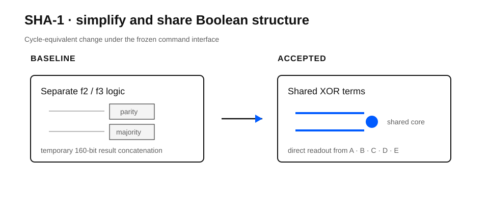
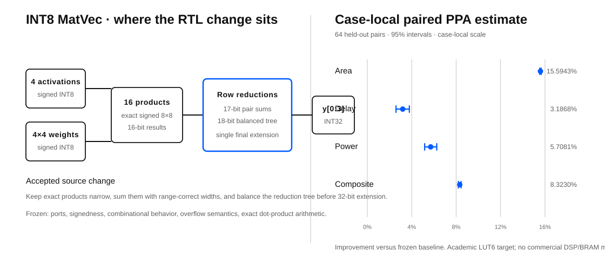
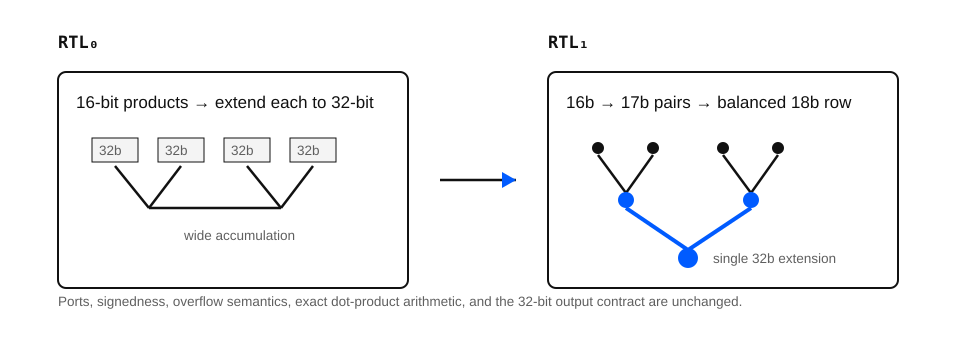
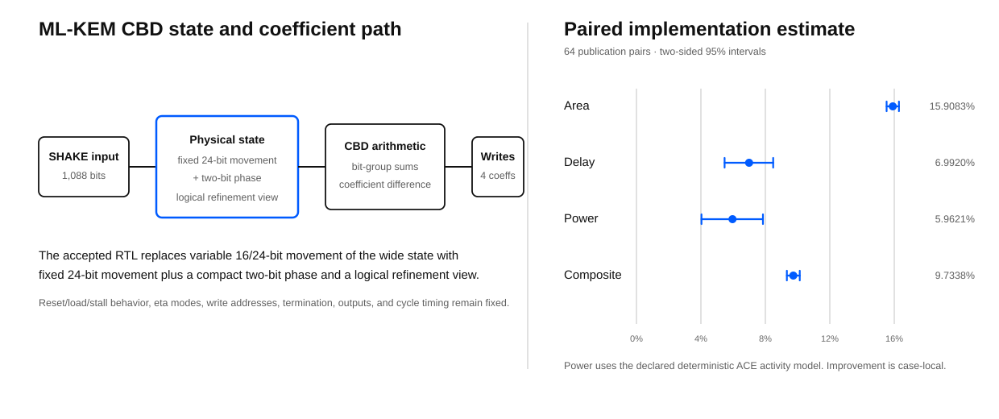
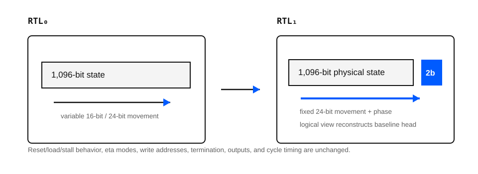

# Verified RTL optimization

## Abstract

This portfolio reports three correctness-gated before/after RTL transformations under pinned academic implementation contracts. The cases are intentionally different: SHA-1 simplifies local Boolean and state-readout logic, INT8 MatVec restructures arithmetic widths and the addition tree, and ML-KEM CBD changes the physical representation of sequential state while preserving the same logical state view.

The result is not a leaderboard and has no pooled portfolio score. Each percentage below is a case-local paired estimate under that circuit's own frozen contract. The portfolio establishes an inspectable evidence pattern: freeze the contract, prove the accepted implementation is valid, measure it against the baseline, and publish the exact technical delta with its limitations.

## 1. Why RTL optimization matters

Register-transfer level design fixes more than functional equations. RTL encodes state, operator widths, mux structure, resource sharing, arithmetic topology, enables, pipeline boundaries, and cycle-level protocol. Synthesis and technology mapping can simplify and canonicalize aggressively, but they operate inside the behavioral and timing contract they are given. Two functionally equivalent descriptions can therefore induce materially different mapped logic depth, fanout, routing pressure, switching activity, and resource count.

That is why RTL optimization is an implementation problem rather than a source-code beauty contest. A useful transformation changes the structure presented to the downstream toolchain while preserving the interface and the declared observable behavior.



PPA is shorthand for **power, performance, and area**. In these public cases the terms have a deliberately narrow implementation-level meaning:

| Dimension | Current public measurement | What it does not mean |
|---|---|---|
| Area | VTR total-area estimate after mapping and implementation on the pinned academic architecture | ASIC die area or commercial FPGA resource characterization |
| Performance | Post-route critical-path delay; lower delay permits a higher implementation-level clock bound when that path is limiting | End-to-end application throughput or system latency |
| Power | Active total-power estimate under the case's declared activity model and PTM 45 nm conditions | Board power, measured energy, thermal behavior, or silicon characterization |

For a limiting post-route critical path, the corresponding implementation-level clock bound is approximately

$$
f_{max}[\mathrm{MHz}] \approx \frac{1000}{t_{crit}[\mathrm{ns}]}
$$

This relation is a timing interpretation of the routed implementation; it is not a claim about complete-system throughput.

Physical implementation is heuristic and seed-sensitive, so a single place-and-route result is a weak comparison. The public cases compare the frozen baseline and accepted RTL through matched implementation pairs. The estimator therefore asks whether the source transformation survives implementation variation rather than whether one favorable run happened to win.

### Evidence-scale warning

**These are bounded proof-of-method RTL benchmarks, not industrial-scale subsystem results.** They were chosen so that the complete evidence boundary can remain public and inspectable: baseline RTL, accepted RTL, exact patch, functional/formal correctness, paired implementation evidence, provenance, and verifier output.

That makes the three cases useful evidence that the method works end to end. It does **not** yet establish performance on large multi-module subsystems, memory/interconnect-heavy datapaths, deep pipeline/control interactions, commercial FPGA or ASIC flows, customer-owned production RTL, or manufactured silicon.

Higher-complexity RTL cases are currently in progress. This Result will be updated only when those cases satisfy the same correctness, provenance, frozen-contract, and measurement requirements; work in progress is not counted as public evidence.

## 2. Three transformation regimes

The value of the portfolio is not that three circuits happened to move by different percentages. It is that the accepted changes operate at three different structural levels of RTL.



| Case | Structural change | Correctness boundary | Case-local composite |
|---|---|---|---:|
| SHA-1 RTL | Shared Boolean terms and direct state readout | Cycle regression, NIST vectors, sequential EQY | **2.27% lower** |
| INT8 MatVec RTL | Range-correct intermediate widths and balanced addition tree | Deterministic simulation, exhaustive combinational equivalence | **8.3230% lower** |
| ML-KEM CBD RTL | Fixed 24-bit physical movement plus a two-bit byte phase | Dual-design regression, sequential induction, logical-state refinement | **9.7338% lower** |

All three public composites use 64 fixed publication pairs and the same equal-weight area-delay-power score form. That common form supports consistent case-local acceptance; it does not make the circuits a cross-case performance ranking.

## 3. Common evaluation methodology

The evaluation contract is frozen before the accepted implementation is measured. Editable RTL, protected interfaces, functional semantics, formal scope, toolchain, target, metrics, sampling policy, and validity limits belong to the experiment identity.

A candidate that fails correctness cannot receive a PPA improvement score. Missing, inconclusive, or timed-out required evidence fails closed.



All current cases use a pinned Linux/amd64 VTR/VPR flow, a homogeneous academic LUT6 architecture, and the PTM 45 nm model at 0.9 V and 85 C. The target does not model commercial DSP slices, BRAM, or ASIC arithmetic cells. Total area, post-route critical-path delay, and active total power are implementation-model estimates, not physical measurements.

For publication pair \(i\) and primary metric \(m\in\{A,D,P\}\), the verifier starts from the accepted and baseline measurements under the same paired implementation condition:

$$
r_{m,i}=\frac{x^{(acc)}_{m,i}}{x^{(base)}_{m,i}},
\qquad
\ell_{m,i}=\ln r_{m,i}
$$

Ratio space is directional: \(r<1\) is an improvement, \(r=1\) is parity, and \(r>1\) is a regression. The percentage convention used throughout the Result is

$$
I(r)=100(1-r)
$$

The composite is formed inside each pair from the three primary ratios. Equivalently, it is the arithmetic mean in log-ratio space and the geometric mean in ratio space:

$$
\ell_{C,i}=\frac{\ell_{A,i}+\ell_{D,i}+\ell_{P,i}}{3},
\qquad
r_{C,i}=\exp(\ell_{C,i})
=\left(r_{A,i}r_{D,i}r_{P,i}\right)^{1/3}
$$

The published point estimate is not obtained by averaging percentage improvements. For each metric, including the composite, the 64 log-ratios are summarized as

$$
\bar{\ell}_m=\frac{1}{n}\sum_{i=1}^{n}\ell_{m,i},
\qquad
s_m=\sqrt{\frac{1}{n-1}\sum_{i=1}^{n}\left(\ell_{m,i}-\bar{\ell}_m\right)^2},
\qquad
SE_m=\frac{s_m}{\sqrt{n}},
\quad n=64
$$

and transformed back to ratio space:

$$
\hat r_m=\exp(\bar{\ell}_m),
\qquad
\hat I_m=100\left(1-\hat r_m\right)
$$

The two-sided 95% interval is computed in log space with a Student-t critical value for 63 degrees of freedom,

$$
L_m=\exp\left(\bar{\ell}_m-t_{0.975,63}SE_m\right),
\qquad
U_m=\exp\left(\bar{\ell}_m+t_{0.975,63}SE_m\right),
\qquad
t_{0.975,63}=1.9983405425207417
$$

then reported on the improvement scale as

$$
CI^{95\%}_{I_m}=\left[100(1-U_m),\;100(1-L_m)\right]
$$

The acceptance test uses separate one-sided 95% bounds. With \(t_{0.95,63}=1.6694022217068127\), define

$$
U^{(1)}_C=\exp\left(\bar{\ell}_C+t_{0.95,63}SE_C\right),
\qquad
L^{(1)}_m=\exp\left(\bar{\ell}_m-t_{0.95,63}SE_m\right)
$$

The PPA gate accepts only if the composite upper one-sided bound is below parity and no primary metric is statistically established as a regression under the declared rule:

$$
U^{(1)}_C<1,
\qquad
L^{(1)}_m\leq 1\quad\text{for every }m\in\{A,D,P\}
$$

These statistical conditions are necessary but not sufficient: structural, functional, formal, route, power, evidence-integrity, and declared validity gates must also pass. Search-visible evidence and the fixed publication sample remain separate under the source case contracts.

The complete common contract is published in [evaluation_contract.md](artifacts/evaluation_contract.md), and the case verifiers recompute the published statistics directly from the public paired values.

## 4. SHA-1 RTL — Boolean simplification

The first case is a stateful SHA-1 compression core with a 32-bit command/data interface and an 80-round compression schedule. SHA-1 is retained here as a legacy compute benchmark, not as a recommended modern security primitive.



The accepted RTL makes three cycle-equivalent changes: it replaces XOR with OR where the choose-function terms are mutually exclusive, shares XOR terms across the parity and majority logic, and reads the five chaining-state registers directly rather than slicing a temporary 160-bit concatenation.



The exact public source delta is [sha1.patch](artifacts/patches/sha1.patch). Stable baseline and accepted implementation identities are listed in [baseline-implementations.json](artifacts/baseline-implementations.json) and [accepted-implementations.json](artifacts/accepted-implementations.json).

### Correctness gate

The published case includes 129 NIST SHA-1 Short and Long Message cases, deterministic cycle-level protocol regression, and complete two-state sequential EQY equivalence after reset under the declared defined-input contract.

### Paired result

| Metric | Paired improvement | 95% interval |
|---|---:|---:|
| Total area estimate | **0.15%** | 0.08% to 0.21% |
| Critical-path delay | **5.20%** | 4.64% to 5.75% |
| Active total power estimate | **1.38%** | 0.89% to 1.87% |
| Composite PPA | **2.27%** | 2.12% to 2.41% |

The composite improves in all 64 publication pairs. Individual metrics remain statistical readouts rather than a claim that every placement improves identically.

[Case report](https://github.com/juan-fernandez-gotherlabs/rtl-optimization-case-study/blob/v2.2.2/cases/sha1/technical-report.pdf) · [Case source](https://github.com/juan-fernandez-gotherlabs/rtl-optimization-case-study/tree/v2.2.2/cases/sha1) · [Verifier](https://github.com/juan-fernandez-gotherlabs/rtl-optimization-case-study/blob/v2.2.2/cases/sha1/verify.py) · [Raw evidence archive](https://github.com/juan-fernandez-gotherlabs/rtl-optimization-case-study/releases/download/v2.1.0/sha1-vtr45-full-evidence-v2.tar.gz)

## 5. INT8 MatVec RTL — Arithmetic restructuring

The second case is a combinational signed INT8 4x4 matrix-vector datapath. It performs sixteen exact 8x8 multiplications and returns four signed INT32 dot products.



The baseline extends every product to 32 bits before a wide chained accumulation. The accepted RTL keeps the exact numerical range narrow for longer: signed 16-bit products feed pairwise 17-bit sums, then balanced 18-bit row sums, and only the final value is sign-extended to the 32-bit output interface.



The exact public source delta is [int8-matvec.patch](artifacts/patches/int8-matvec.patch).

### Correctness gate

The published case includes 151 deterministic signed, extreme, lane, row, and seeded-random simulations plus exhaustive Yosys combinational equivalence for every 160-bit input assignment under the frozen I/O contract. A separate deterministic replay exists for baseline and accepted RTL, but it is project-operated evidence rather than independent third-party reproduction.

### Paired result

| Metric | Paired improvement | 95% interval |
|---|---:|---:|
| Total area estimate | **15.5943%** | 15.5355% to 15.6531% |
| Critical-path delay | **3.1868%** | 2.5843% to 3.7855% |
| Active total power estimate | **5.7081%** | 5.1622% to 6.2509% |
| Composite PPA | **8.3230%** | 8.1997% to 8.4462% |

The target contains no commercial DSP-slice, BRAM, or ASIC MAC-cell model, so the result should not be transferred directly to an implementation flow with those resources.

[Case report](https://github.com/juan-fernandez-gotherlabs/rtl-optimization-case-study/blob/v2.2.2/cases/int8-matvec/technical-report.pdf) · [Case source](https://github.com/juan-fernandez-gotherlabs/rtl-optimization-case-study/tree/v2.2.2/cases/int8-matvec) · [Verifier](https://github.com/juan-fernandez-gotherlabs/rtl-optimization-case-study/blob/v2.2.2/cases/int8-matvec/verify.py) · [Raw evidence archive](https://github.com/juan-fernandez-gotherlabs/rtl-optimization-case-study/releases/download/v2.0.1/int8-matvec-vtr45-full-evidence-v1.tar.gz)

## 6. ML-KEM CBD RTL — State representation

The third case is a stateful centred-binomial-distribution sampler from the open HOPE-MLKEM implementation. It consumes SHAKE-derived bits and produces the small positive and negative coefficients used as controlled mathematical noise in ML-KEM.



The baseline physically advances a 1,096-bit state by either 16 or 24 bits depending on eta. The accepted representation always moves the physical state in fixed 24-bit chunks and records the remaining byte offset in a two-bit phase. A logical state view reconstructs the same head observed by the existing coefficient arithmetic.



The exact public source delta is [mlkem-cbd.patch](artifacts/patches/mlkem-cbd.patch).

### Correctness gate

The published case includes lint and hierarchy/interface checks, a 239-cycle dual-design regression with 239 checks across reset, eta 2/3, stalls, reload, and second-load behavior, and complete sequential EQY equivalence using five-step temporal induction after the declared two-cycle reset.

The five-step induction is not a five-cycle-only test. It establishes the invariant for arbitrary future cycles after reset. The formal setup also exposes a joined 1,096-bit logical-state refinement relation between the new physical representation and the baseline state.

### Paired result

| Metric | Paired improvement | 95% interval |
|---|---:|---:|
| Total area estimate | **15.9083%** | 15.5265% to 16.2884% |
| Critical-path delay | **6.9920%** | 5.4724% to 8.4872% |
| Active total power estimate | **5.9621%** | 4.0336% to 7.8519% |
| Composite PPA | **9.7338%** | 9.3331% to 10.1327% |

The power comparison uses the case's declared deterministic ACE probabilistic activity model. This is not side-channel analysis and does not certify a complete ML-KEM implementation.

[Case report](https://github.com/juan-fernandez-gotherlabs/rtl-optimization-case-study/blob/v2.2.2/cases/mlkem-cbd/technical-report.pdf) · [Case source](https://github.com/juan-fernandez-gotherlabs/rtl-optimization-case-study/tree/v2.2.2/cases/mlkem-cbd) · [Verifier](https://github.com/juan-fernandez-gotherlabs/rtl-optimization-case-study/blob/v2.2.2/cases/mlkem-cbd/verify.py) · [Raw evidence archive](https://github.com/juan-fernandez-gotherlabs/rtl-optimization-case-study/releases/download/v2.2.0/mlkem-cbd-vtr45-full-evidence-v1.tar.gz)

## 7. Portfolio readout

| Case | Area | Delay | Active power | Composite |
|---|---:|---:|---:|---:|
| SHA-1 | 0.15% lower | 5.20% lower | 1.38% lower | 2.27% lower |
| INT8 MatVec | 15.5943% lower | 3.1868% lower | 5.7081% lower | 8.3230% lower |
| ML-KEM CBD | 15.9083% lower | 6.9920% lower | 5.9621% lower | 9.7338% lower |

These rows are case-local paired estimates. Do not rank, average, or interpret them as an expected range for another circuit.

The machine-readable paired readout is published in [evaluation.json](artifacts/evaluation.json), with the Results-facing comparison surface in [metrics.json](artifacts/metrics.json).

## 8. What the portfolio establishes

The public evidence establishes that three distinct RTL transformations were frozen, correctness-gated, measured under declared implementation contracts, and published with inspectable before/after identities and exact source changes.

The portfolio demonstrates reasoning over local Boolean structure, arithmetic width and tree structure, and sequential physical state representation. It also demonstrates a repeatable evidence boundary: baseline identity, accepted identity, exact patch, correctness evidence, paired implementation evidence, provenance, and a fail-closed verifier path.

It does not establish that these transformations generalize to another design, that the percentages are comparable across circuits, or that Göther replaces a customer's implementation or signoff authority. The current public evidence scale is intentionally smaller than the industrial workloads the methodology is intended to address next.

## 9. Evidence and assurance status

| Evidence layer | Public status |
|---|---|
| Compact consistency verifier | Available and automated |
| Hash-addressed raw evidence archive | Available per case |
| Metric re-extraction from archived logs | Supported by case verifiers |
| Fresh EDA rerun by an external organization | **Not claimed** |
| Accredited certification or signed third-party assurance | **None** |
| Physical FPGA, ASIC, board, or silicon measurement | **Not claimed** |

The raw verifier checks recorded provenance and re-extracts the published PPA values. It does not rerun the EDA tools. A fresh external reproduction would rebuild the pinned environment and regenerate the implementation evidence independently.

The public audit protocol is available in [AUDIT.md](https://github.com/juan-fernandez-gotherlabs/rtl-optimization-case-study/blob/v2.2.2/AUDIT.md).

## 10. Reproducibility and authority

The quantitative authority for this Result is the reviewed public evidence release `v2.2.2`, commit `8cd8b479488f0693d76c2fab39eabf4bd6f9279c`. Later repository changes are not silently promoted into this claim surface.

From a clean checkout of that release, the compact portfolio verifier is:

```text
python3 verify.py
```

The expected result is a PASS for SHA-1, INT8 MatVec, ML-KEM CBD, and the portfolio-level consistency check. Supplying each case's published raw evidence archive adds archive-member and metric-extraction verification; it still does not constitute a fresh EDA run.

[Canonical evidence repository](https://github.com/juan-fernandez-gotherlabs/rtl-optimization-case-study/tree/v2.2.2) · [Methodology](https://github.com/juan-fernandez-gotherlabs/rtl-optimization-case-study/blob/v2.2.2/METHODOLOGY.md) · [Audit protocol](https://github.com/juan-fernandez-gotherlabs/rtl-optimization-case-study/blob/v2.2.2/AUDIT.md) · [Third-party notices](https://github.com/juan-fernandez-gotherlabs/rtl-optimization-case-study/blob/v2.2.2/THIRD_PARTY_NOTICES.md)

The next commercial step is deliberately outside this technical note: [evaluate one owned RTL block](https://www.gotherlabs.com/rtl-optimization/) in the customer's authoritative implementation flow.
